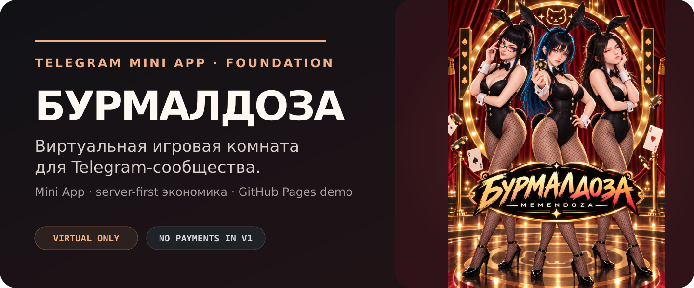

<p align="center">
  <picture>
    <source media="(max-width: 700px)" srcset="./assets/readme/hero-mobile.png">
    
  </picture>
</p>

# Бурмалдоза

Игровой слой для Telegram-сообщества Memendoza: бот — точка входа, Mini App — игровой лаунж, FastAPI — источник подтверждённого состояния.

[Открыть Pages-пилот](https://hainox.github.io/BURMALDOZA/) · [Локальный запуск](./docs/Local-Setup.md) · [BuildSpec](./dev/BuildSpec.md) · [Slot v2](./docs/Slot-V2-Status.md) · [CCode workflow](./docs/Command-Code-Workflow.md) · [Архитектура](./docs/Technical-Architecture.md)

> В репозитории есть два режима: Pages-demo с безопасным demo-fallback и server-first режим для Telegram Mini App. Если `PUBLIC_API_BASE_URL` или Telegram `initData` отсутствуют, клиент остаётся в демо-контуре; платежи и реальные деньги не подключены.

## Что собрано

| Часть | Сейчас | Граница |
|---|---|---|
| Domain | 3×7 Slot, Blackjack GFL, heads-up Hold’em / RGG Poker | чистые правила, CSPRNG adapter, seeded Monte Carlo вне request path |
| Economy | Jokergem (`JOKERGEM`), welcome/daily/relief baseline | целые единицы, append-only ledger, no cash value |
| API | FastAPI auth, wallet, rooms, snapshots/events, reconnect | raw Telegram `initData`, idempotency, state version |
| Bot | aiogram `/start`, `/casino`, `/balance`, `/top`, `/help` | ответы по явной команде, API-backed balance/top |
| Mini App | SvelteKit shell, три room views, safe areas, reduced motion, live API client | UI получает подтверждённый server event; без API работает DEMO fallback |
| Runtime | Dockerfile API/bot/Mini App, Compose, CI | PostgreSQL 16, Redis 7, health checks |

## Игровые комнаты

- **3×7 Slot** — три барабана, семь рядов и payline choreography.
- **Blackjack GFL** — Hit / Stand / Double, dealer hole-card и staggered deal.
- **Hold’em / RGG Poker** — два места, один pot, Fold / Check / Call / Raise.

У всех комнат одна state-driven последовательность: `intent → accepted → resolving → confirmed outcome → settle`. Анимация не генерирует исход; она объясняет уже подтверждённое событие. При reduced motion промежуточные эффекты схлопываются, но legal actions и result explanation остаются.

Slot v2 дополнительно требует полной вертикальной прокрутки барабанов, разгона, инерционного торможения, последовательной остановки слева направо, payout highlight и пяти Free Spins. Бонусная мини-игра пока остаётся временной заглушкой и помечена на отдельную переделку.

## Jokergem v0.1

Название provisional и может быть заменено без миграции целочисленных балансов.

- welcome: `1 000` один раз;
- daily: `250` раз в 24 часа;
- relief: `300` при балансе ниже `50`, не чаще раза в 72 часа;
- нет покупки, вывода, обмена, Stars, призов и реальных денег.

Это техническая baseline-конфигурация для закрытого теста, а не обещание дохода и не решение о монетизации.

## Разработка

```bash
cp .env.example .env
pnpm install --frozen-lockfile
uv sync --locked --all-groups
pnpm --dir apps/miniapp exec playwright install chromium
```

Полная Compose-инструкция и правила секретов: [docs/Local-Setup.md](./docs/Local-Setup.md).

Для live-режима нужен публичный HTTPS API endpoint. Локальный build с API:

```bash
PUBLIC_API_BASE_URL=http://localhost:8000 pnpm --dir apps/miniapp build
```

Для GitHub Pages задайте repository/environment variable `PUBLIC_API_BASE_URL`; Pages workflow передаст её в build. Если переменная пустая, опубликованный URL намеренно остаётся визуальным DEMO.

Основные проверки:

```bash
uv run --locked ruff check .
uv run --locked pytest -q
pnpm miniapp:check
pnpm miniapp:test
pnpm miniapp:build
pnpm miniapp:e2e
```

Monte Carlo evidence:

```bash
python -m devtools.monte_carlo.slot --trials 100000 --bet 10 --seed 42 --json
python -m devtools.monte_carlo.blackjack --trials 100000 --bet 25 --seed 42 --json
python -m devtools.monte_carlo.holdem --trials 100000 --seed 42 --json
```

CI повторяет Python lint/tests, Mini App check/test/build, PostgreSQL/Redis services и сохраняет три JSON-отчёта как artifact.

## Проверенное состояние коммита `05d8aaa`

- Python dependencies установлены через `uv sync --locked --all-groups`.
- Node dependencies установлены через `pnpm install --frozen-lockfile`.
- `uv run --locked pytest -q`: 70 passed, 3 skipped.
- `uv run --locked ruff check .`: clean.
- `pnpm miniapp:check`: 0 errors/0 warnings.
- `pnpm miniapp:test`: 15 passed.
- `pnpm miniapp:build`: passed with and without `PUBLIC_API_BASE_URL`.
- Remote CI: Docker Compose build, Mini App E2E, Monte Carlo evidence and Pages deploy passed.
- Локальный Playwright запуск требует установленного Chromium; CI устанавливает браузер автоматически.

## Документы

- [BuildSpec](./dev/BuildSpec.md) — комнаты, экономика, границы и критерии приёмки.
- [Роадмап](./docs/Development-Roadmap.md) — foundation → tests → QA → thematic content.
- [Техническая архитектура](./docs/Technical-Architecture.md) — границы модулей и финальный стек.
- [Design concept](./docs/Design-Concept.md) — native UI и motion system.
- [Slot v2 status](./docs/Slot-V2-Status.md) — полный цикл барабанов, Free Spins и тестовая матрица.
- [Codex ↔ Command Code workflow](./docs/Command-Code-Workflow.md) — модели, effort и handoff-шаблон.
- [Project log](./dev/ProjectLog.md) — решения и evidence.

Лицензия пока не выбрана; файл `LICENSE` отсутствует.
