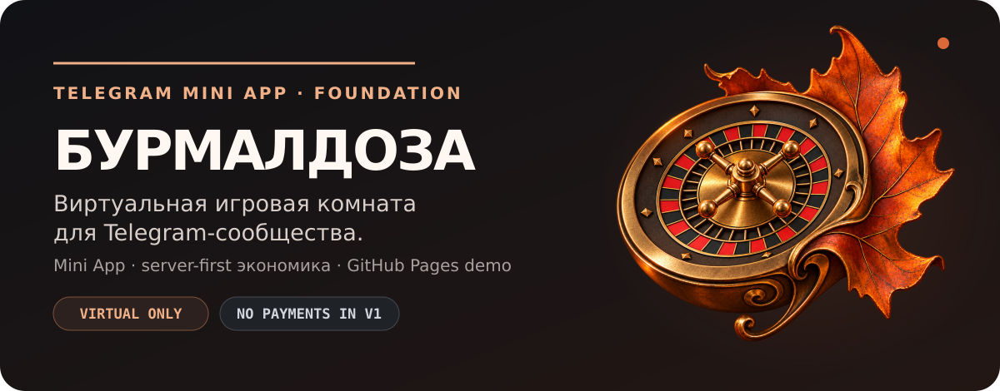
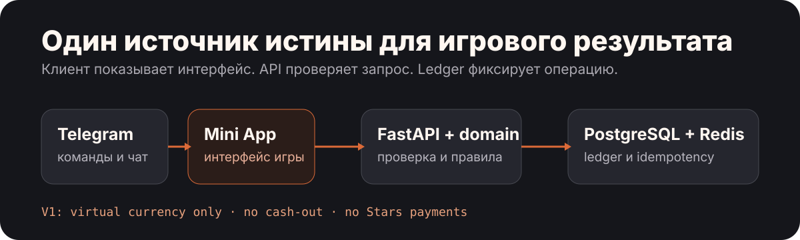

<p align="center">
  
</p>

# Бурмалдоза

Виртуальное казино и игровой слой для Telegram-сообщества. Первый запуск планируется для Memendoza: игры — в Mini App, общение — в чате. Самостоятельный проект, а не копия YUVI.

[Посмотреть демо](#демо) · [Запустить локально](#разработка) · [Роадмап](./docs/Development-Roadmap.md) · [Техническая архитектура](./docs/Technical-Architecture.md)

> Сейчас это **дизайн-прототип и технический каркас**, не работающий Telegram-бот. Серверная экономика, авторизация, игровые команды и платежи ещё не реализованы. [BuildSpec](./dev/BuildSpec.md) остаётся черновиком.

## Демо

Интерактивная рулетка показывает предполагаемый интерфейс: виртуальный баланс, ввод ставки, анимацию, результат и историю. Чтобы открыть её, достаточно Python — Node.js, Docker и Telegram-аккаунт не нужны.

Из корня репозитория:

```bash
python -m http.server 4173 --bind 127.0.0.1 --directory docs/pages-demo
```

Откройте **http://localhost:4173/**.

- Стартовый баланс — 4 260 демонстрационных жетонов; ставка — от 10 до 500.
- Результат задан сценарием: два выигрыша, затем проигрыш. Это не случайная рулетка и не модель вероятностей будущей игры.
- После обновления страницы баланс и история сбрасываются. Демо не отправляет игровые данные на сервер, не сохраняет их и не принимает платежи.
- Карточки слотов и дуэлей — иллюстрации возможного развития, не готовые игры и не утверждённые обязательства.

Для показа через GitHub Pages подготовлен [workflow](./.github/workflows/deploy-pages.yml). Владелец должен выбрать **Settings → Pages → Source → GitHub Actions**. Адрес после успешного развёртывания: **https://hainox.github.io/BURMALDOZA/**. Наличие workflow само по себе не означает, что сайт уже опубликован — проверьте [Actions](https://github.com/Hainox/BURMALDOZA/actions).

Пошаговая инструкция и ручные проверки: [Pages-Deploy.md](./docs/Pages-Deploy.md).

## Что есть в репозитории

| Часть | Реализовано сейчас | Дальше, после утверждения ТЗ |
| --- | --- | --- |
| Демо | Автономная HTML/CSS/JS-рулетка | Перенос утверждённого интерфейса в Mini App |
| Mini App | SvelteKit + TypeScript, стартовая страница, `adapter-static` | Telegram-авторизация, игры, история и рейтинг |
| API | FastAPI, `GET /health`, unit-тест | Проверка `initData`, игровые запросы, лимиты и роли |
| Бот | Чтение и проверка обязательной конфигурации | Запуск aiogram, команды и привязка чата |
| Данные | Compose-сервисы PostgreSQL и Redis; каркасы domain/contracts | Миграции, журнал операций и идемпотентность |
| Документация | Vision, черновик BuildSpec, дизайн-концепция, роадмап | Точное ТЗ администратора и критерии приёмки |

**Pages-демо и SvelteKit-приложение — разные части проекта.** Текущий Pages workflow публикует `docs/pages-demo`, а не сборку `apps/miniapp`.

## К чему идём

Пользователь открывает игру из Telegram. Mini App показывает интерфейс, API проверяет пользователя и запрос, сервер рассчитывает исход, PostgreSQL хранит журнал операций. Redis планируется использовать для лимитов и вспомогательного состояния; защита от двойного списания должна обеспечиваться транзакциями и ограничениями БД.

<p align="center">
  
</p>

Изоляция интерфейса, правил и хранения позволит добавлять игры без переписывания бота. Сейчас схема описывает направление разработки, а не действующую интеграцию.

Границы первого релиза:

- Одна стартовая игра и один целевой чат. Точные правила, лимиты и роли ещё нужно утвердить.
- Только виртуальные жетоны: без вывода, обмена, реальных денег и покупки шансов.
- Донат через Telegram Stars рассматривается отдельно и не входит в текущий билд.
- Никакого сбора истории чатов, публикации от имени пользователя или автоматических рассылок по умолчанию.

## Разработка

Для технического каркаса нужны Python 3.12+, `uv`, Node.js 24+ и pnpm **11.19.0** (версия указана в `package.json`). Docker Engine с Compose нужен только для локальных PostgreSQL/Redis.

```bash
git clone https://github.com/Hainox/BURMALDOZA.git
cd BURMALDOZA
uv sync --locked --all-groups
pnpm install --frozen-lockfile
```

Версии зависимостей сохранены в `uv.lock` и `pnpm-lock.yaml`. Владелец разрешил install-script только для `esbuild` в `pnpm-workspace.yaml`; новые пакеты с такими скриптами требуют отдельной проверки. Подробности — в [Local-Setup.md](./docs/Local-Setup.md).

API запускается отдельно:

```bash
uv run uvicorn app.main:app --app-dir apps/api --reload
```

Проверка: **http://127.0.0.1:8000/health** должна вернуть `{"status":"ok","service":"api"}`. Этот endpoint проверяет только доступность API, не БД и не готовность игрового контура.

В другом терминале можно открыть стартовую страницу SvelteKit:

```bash
pnpm miniapp:dev
```

Бот пока не имеет команды запуска и обработчиков Telegram. Токен для демо, стартовой страницы и `/health` не нужен. Подготовка `.env` и базы описана в [Local-Setup.md](./docs/Local-Setup.md); реальные секреты не коммитьте.

## Проверки

После установки зависимостей:

```bash
uv run pytest -q
uv run ruff check .
pnpm miniapp:check
pnpm miniapp:build
docker compose config -q
```

Последняя команда требует локальной `.env` с `POSTGRES_PASSWORD`. Проверка конфигурации Compose не заменяет запуск сервисов.

При подготовке публикации:

- `pytest`: 1 тест пройден; 2 deprecation-предупреждения зависимостей Starlette/httpx/AnyIO.
- `ruff`: ошибок нет; `svelte-check`: 0 ошибок и 0 предупреждений; статическая SvelteKit-сборка завершилась успешно.
- Аудит обоих изображений README, проверка локальных ссылок, JSON/SVG и синтаксиса Python пройдены.
- 10 проверок сценария демо в Node.js пройдены; это не браузерные end-to-end тесты.
- Docker/Compose не проверены: Docker отсутствует в окружении. Браузерная проверка на телефоне и компьютере остаётся по [чек-листу](./docs/Pages-Deploy.md).

Успешная сборка каркаса не означает готовность игровых функций или production-релиза.

## Документы и следующие решения

| Документ | Для чего |
| --- | --- |
| [Vision](./dev/Vision.md) | Назначение продукта и постоянные границы |
| [BuildSpec](./dev/BuildSpec.md) | Черновик состава первого релиза и приёмки |
| [Роадмап разработки](./docs/Development-Roadmap.md) | Этапы, зависимости и ориентировочные сроки |
| [Что нужно от владельца](./docs/Roadmap-and-Inputs.md) | Входные данные и решения для разработки |
| [Дизайн-концепция](./docs/Design-Concept.md) | Экраны и направление интерфейса |
| [Архитектура](./docs/Technical-Architecture.md) | Компоненты и ответственность модулей |
| [Журнал проекта](./dev/ProjectLog.md) | Принятые решения, проверки и незавершённая работа |

Следующий шаг — согласовать первую игру, экономику и лимиты, целевой чат и администраторов, затем утвердить BuildSpec. Привязка Telegram и платёжный контур до этого не включаются.

## Лицензия

Лицензия пока не выбрана; файл `LICENSE` отсутствует. Выбор лицензии остаётся за владельцем проекта.
