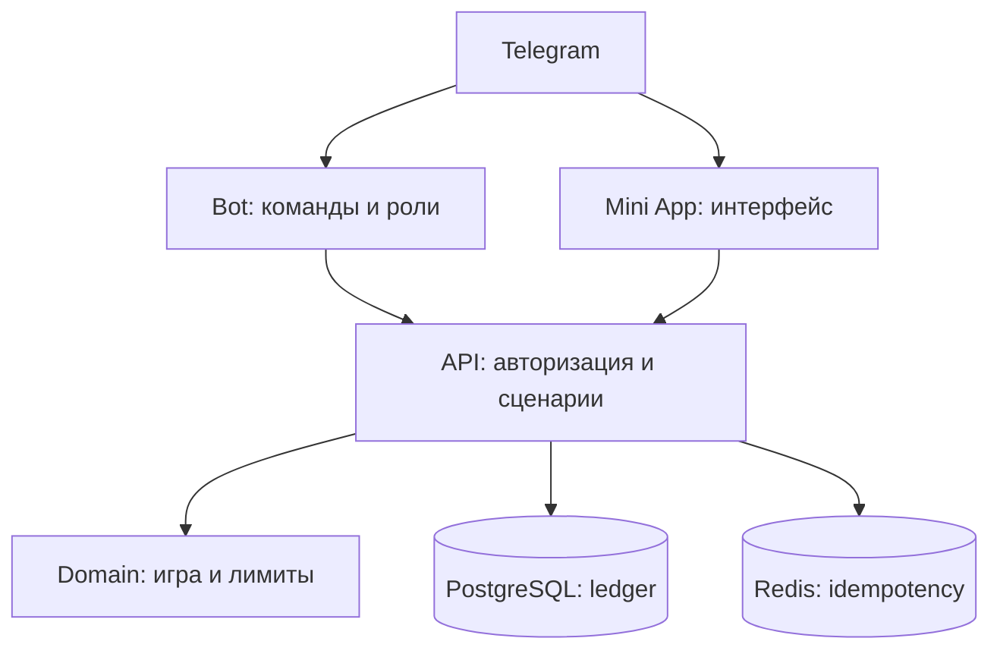

# Бурмалдоза — техническая архитектура и skeleton

## Выбранный стек

| Слой | Решение | Зачем |
|---|---|---|
| Telegram bot | Python 3.12 + aiogram 3 | Асинхронные update, команды и роли. |
| API | FastAPI + Pydantic | Mini App API, админские маршруты, OpenAPI. |
| Mini App | SvelteKit + TypeScript + adapter-static | Совпадает с проверенным референсом YUVI, даёт компактный мобильный UI и не смешивает фронтенд с FastAPI. |
| База | PostgreSQL + SQLAlchemy + Alembic | Транзакции, журнал операций и миграции. |
| Очереди/защита | Redis | Идемпотентность, rate limit, фоновые задачи. |
| Наблюдаемость | Sentry-compatible errors + structured logs + health endpoints | Диагностика без чтения пользовательских чатов. |
| Deploy | Docker Compose, затем CI/CD | Воспроизводимый локальный и серверный запуск. |

## Целевая структура репозитория

```text
burmaldoza/
  apps/
    bot/                 # aiogram: команды, middleware, chat settings
    api/                 # FastAPI: Mini App и admin API
    miniapp/             # SvelteKit Telegram Mini App (статическая сборка)
  packages/
    domain/              # правила игр и расчёт исходов без Telegram/UI
    contracts/           # DTO, events, OpenAPI-generated types
  infra/
    docker/              # контейнеры, nginx, локальная среда
  migrations/            # Alembic
  tests/
    unit/                # domain: RNG, выплаты, лимиты
    integration/         # PostgreSQL/Redis/API
    e2e/                 # Mini App critical paths
  docs/
  dev/
```

## Границы модулей



## Данные v1

- `users` — Telegram ID, отображаемое имя, дата входа, настройки публичности.
- `communities` и `chat_settings` — один выбранный чат, владельцы, лимиты, включённые модули.
- `wallets` — производный текущий баланс, проверяемый против журнала.
- `ledger_entries` — неизменяемые начисления, списания, корректировки и их причины.
- `game_rounds` — ставка, вариант игры, серверный результат, idempotency key, ссылка на операции.
- `admin_audit_log` — кто и что поменял.

## Критические правила

- Проверять Telegram `initData` на API; нельзя доверять `user.id` из браузера.
- Для одной ставки использовать одну транзакцию БД: блокировка кошелька, лимит, игра, две записи ledger, commit.
- Генератор результата и таблица выплат живут в domain-слое и тестируются отдельно.
- У каждого mutating API-запроса есть idempotency key.
- Админские действия требуют серверной роли; ID администратора не хардкодится в клиенте.
- Секреты только через секрет-хранилище/переменные окружения; `.env` не коммитится.

## Правило для SvelteKit

Mini App собирается статически через `adapter-static`; серверный рендер и серверные endpoints SvelteKit не используются. Все защищённые сценарии остаются в FastAPI, а SvelteKit отвечает за интерфейс, локальное состояние и вызов API.

## Stars: отдельный будущий контур

Если появится цифровой платный товар в Telegram, платёж идёт через Stars (`XTR`), нужны обработка `pre_checkout_query`, `successful_payment`, хранение идентификатора платежа и возвраты. Платёжный модуль не связан с `ledger_entries` виртуального казино до отдельного юридического и продуктового решения. Telegram также требует `/paysupport` для продавца цифровых товаров.
