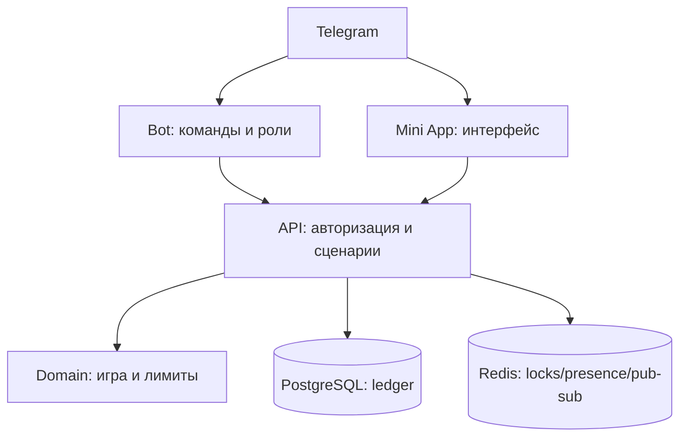

# Бурмалдоза — техническая архитектура и skeleton

## Итоговый стек foundation

Репозиторий остаётся модульным монолитом: единый API-контур проще проверять на идемпотентность и не заставляет игровые правила зависеть от Telegram/UI.

| Контур | Финальное решение | Граница ответственности |
|---|---|---|
| Telegram | aiogram 3, Python 3.12 | вход, команды, кнопка Mini App, явные ответы |
| API | FastAPI, Pydantic, SQLAlchemy 2 async | auth, wallet, rooms, snapshots/events, idempotency |
| Domain | Python-пакеты + injected `RandomSource` | правила Slot/Blackjack/Hold’em и Monte Carlo вне request path |
| Storage | PostgreSQL 16 + Alembic | durable users, rooms, rounds, actions и append-only ledger |
| Coordination | Redis 7 | locks, presence и pub/sub; не источник баланса |
| Mini App | SvelteKit 2, Svelte 5, TypeScript, Vite, adapter-static | мобильный UI, confirmed state и authored CSS motion |
| Проверки | pytest/pytest-asyncio/Hypothesis, Vitest, Playwright, Ruff | unit, PostgreSQL integration, build и critical browser paths |
| Runtime | Docker Compose, GitHub Actions | одинаковые локальные сервисы и required CI job |

В production Mini App не принимает решение об исходе и не хранит секреты. Анимация — проекция серверного события: `intent → accepted → resolving → confirmed outcome → settle`.

## Выбранный стек

| Слой | Решение | Зачем |
|---|---|---|
| Telegram bot | Python 3.12 + aiogram 3 | Асинхронные update, команды и роли. |
| API | FastAPI + Pydantic | Mini App API, админские маршруты, OpenAPI. |
| Mini App | SvelteKit 2 + Svelte 5 + TypeScript + Vite + adapter-static | Компактный мобильный UI, статическая сборка и чёткая граница с FastAPI. |
| База | PostgreSQL + SQLAlchemy + Alembic | Транзакции, журнал операций и миграции. |
| Очереди/защита | Redis | Идемпотентность, rate limit, фоновые задачи. |
| Наблюдаемость | Sentry-compatible errors + structured logs + `/health/live` и `/health/ready` | Диагностика без чтения пользовательских чатов. |
| Deploy | Docker Compose + GitHub Actions | Воспроизводимый локальный и CI-запуск; Pages остаётся отдельным demo-контуром. |

## Целевая структура репозитория

```text
burmaldoza/
  apps/
    bot/                 # aiogram: команды, middleware, chat settings
    api/                 # FastAPI: Mini App и admin API
    miniapp/             # SvelteKit Telegram Mini App (статическая сборка)
  packages/
    domain/              # правила игр и расчёт исходов без Telegram/UI
    contracts/           # DTO, events, OpenAPI-generated types
  infra/
    docker/              # контейнеры, nginx, локальная среда
  migrations/            # Alembic
  tests/
    unit/                # domain: RNG, выплаты, лимиты
    integration/         # PostgreSQL/Redis/API
    e2e/                 # Mini App critical paths
  docs/
  dev/
```

## Границы модулей



## Данные v1

- `users` — Telegram ID, отображаемое имя, дата входа, настройки публичности.
- `communities` и `chat_settings` — один выбранный чат, владельцы, лимиты, включённые модули.
- `wallets` — производный текущий баланс, проверяемый против журнала.
- `ledger_entries` — неизменяемые начисления, списания, корректировки и их причины.
- `game_rounds` — ставка, вариант игры, серверный результат, idempotency key, ссылка на операции.
- `admin_audit_log` — кто и что поменял.

## Критические правила

- Проверять Telegram `initData` на API; нельзя доверять `user.id` из браузера.
- Для одной ставки использовать одну транзакцию БД: блокировка кошелька, лимит, игра, две записи ledger, commit.
- Генератор результата и таблица выплат живут в domain-слое и тестируются отдельно.
- У каждого mutating API-запроса есть idempotency key.
- Админские действия требуют серверной роли; ID администратора не хардкодится в клиенте.
- Секреты только через секрет-хранилище/переменные окружения; `.env` не коммитится.

## Граница исхода и анимации

Для игровых комнат серверный исход и клиентская анимация — разные слои. API сначала фиксирует результат и ledger, затем Mini App показывает его естественной последовательностью. Клиент не генерирует RNG, не меняет payout и не исправляет баланс после анимации.

Для Slot v2 подтверждённое событие содержит финальную сетку/барабаны, paylines, выплату, новый баланс и состояние Free Spins. Комната обязана визуально пройти полный цикл прокрутки, разгон, инерционное торможение и staged stop; только после подтверждённой остановки показываются выплата и подсветка. Подробный статус — в [Slot-V2-Status.md](./Slot-V2-Status.md).

Визуальные задачи, не меняющие domain/RNG/ledger/contracts, можно отдавать в Command Code по [рабочему процессу](./Command-Code-Workflow.md); в handoff всегда фиксируются модель, effort, разрешённые файлы и тесты.

## Правило для SvelteKit

Mini App собирается статически через `adapter-static`; серверный рендер и серверные endpoints SvelteKit не используются. Все защищённые сценарии остаются в FastAPI, а SvelteKit отвечает за интерфейс, локальное состояние и вызов API. Компоненты комнат не генерируют fake outcomes: в production они получают `RoomSnapshot`/`EventEnvelope`; локальный skeleton явно помечен `DEMO`. Подробный выбор зависимостей и границ — в [SvelteKit-Stack.md](./SvelteKit-Stack.md).

## Stars: отдельный будущий контур

Если появится цифровой платный товар в Telegram, платёж идёт через Stars (`XTR`), нужны обработка `pre_checkout_query`, `successful_payment`, хранение идентификатора платежа и возвраты. Платёжный модуль не связан с `ledger_entries` виртуального казино до отдельного юридического и продуктового решения. Telegram также требует `/paysupport` для продавца цифровых товаров.
