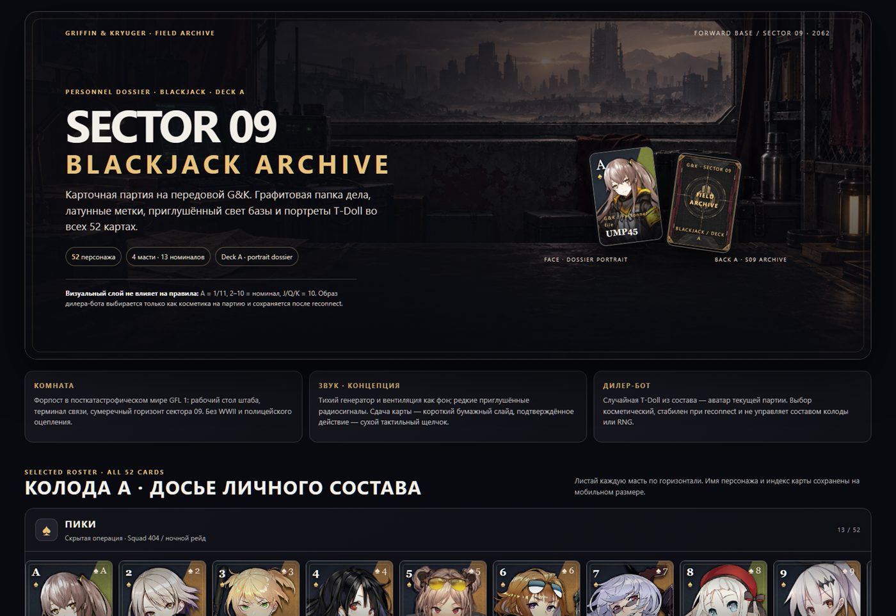
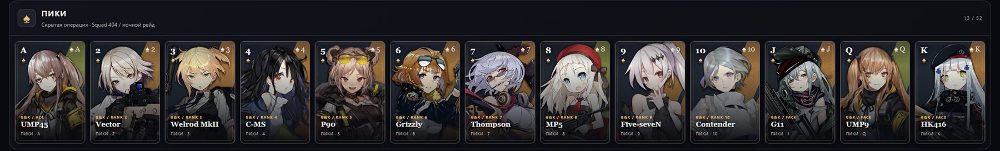
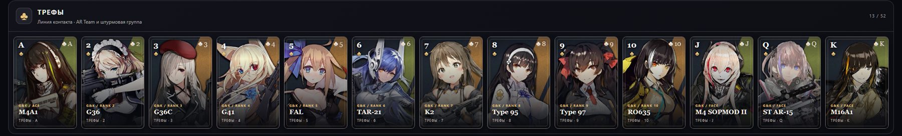
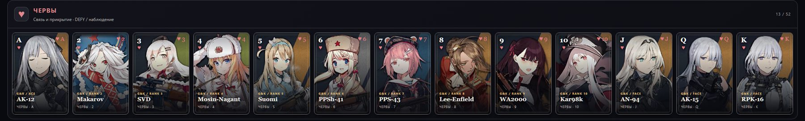
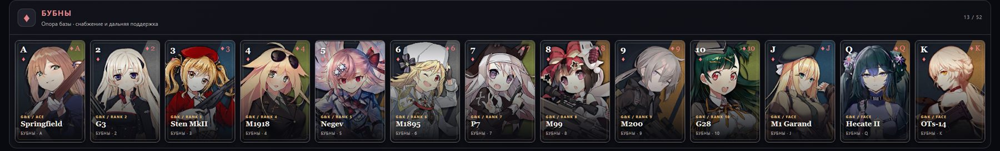

# Blackjack GFL — Deck A · Sector 09

Мобильное превью концепта: комната штаба G&K, лицо карты, рубашка и вся колода из 52 персонажей. Нажми на изображение, чтобы открыть его крупнее.

## Пики · скрытая операция / Squad 404

## Трефы · линия контакта / AR Team

## Червы · связь и прикрытие / DEFY

## Бубны · опора базы / снабжение

## Источники и атрибуция

- Концепт создаётся как неофициальный фанатский материал для знакомства новых игроков с Girls' Frontline. Изображения персонажей — материалы MICA Team / SUNBORN; список персонажей и ссылки на страницы файлов: [`sources.json`](../../../assets/design/blackjack-gfl/deck-a/sources.json).
- По уточнению владельца проекта, MICA публикует материалы GFL для распространения информации об игре и привлечения игроков. Здесь они показаны с атрибуцией только в дизайн-превью; это не заявление о передаче авторских прав или открытой лицензии на другие способы использования.
- [Полная матрица 52 карт](../blackjack-card-roster.html) · [Концепт комнаты](../../../assets/design/blackjack-gfl/deck-a/generated/sector-09-room-concept.png) · [Концепт рубашки](../../../assets/design/blackjack-gfl/deck-a/generated/card-back-a-s09.png) · [IOP Wiki: дисклеймер](https://iopwiki.com/wiki/IOP_Wiki:General_disclaimer).

Комната и рубашка созданы специально для этого черновика. Игровые правила, RNG, результат и серверное состояние от оформления не зависят.
