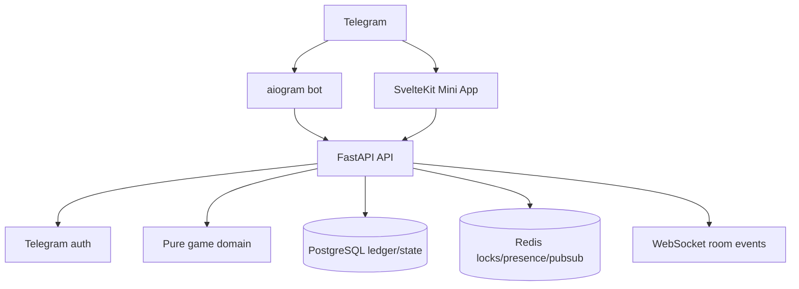

# Бурмалдоза — игровая платформа и первые три комнаты

**Дата:** 2026-09-20  
**Статус:** проектная спецификация на ревью  
**Владелец решения:** Hainox  
**Репозиторий:** `Hainox/BURMALDOZA`  
**Основание:** утверждён модульный монолит, временное название виртуальной валюты «Jokergem», бесплатная экономика без Stars на первом этапе и три комнаты: слот, Blackjack GFL, Texas Hold’em / RGG Poker.

## 1. Решение в одном абзаце

«Бурмалдоза» строится как Telegram Mini App с серверным источником истины. FastAPI принимает и проверяет Telegram `initData`, доменный слой рассчитывает исходы игр, PostgreSQL атомарно фиксирует баланс и журнал операций, Redis отвечает только за эфемерные задачи, а SvelteKit показывает уже подтверждённое состояние и воспроизводит его анимацией. Первый технический релиз содержит не тематические персонажные ассеты, а три полностью проверяемых игровых skeleton-модуля: ставка или действие → серверная валидация → результат → ledger → событие → плавная визуализация.

Результат никогда не генерируется браузером, не зависит от CSS-анимации и не пересчитывается на клиенте. Анимация выразительно объясняет исход, но не меняет его и не создаёт ложные near-miss-сценарии.

## 2. Цели первой версии

### Входит в v1

- Telegram-бот с командами `/start`, `/help`, `/casino` и входом в Mini App.
- Серверная проверка `Telegram.WebApp.initData` с проверкой подписи и свежести `auth_date`.
- Профиль пользователя по Telegram ID без доверия к пользовательским полям из браузера.
- Валюта «Jokergem» без реальной денежной стоимости, обмена, вывода и покупки за Stars.
- Append-only ledger и атомарное изменение баланса.
- Три игровые комнаты:
  - «Однорукий бандит» — layout 3×7, payline-конфигурация и таблица выплат;
  - Blackjack GFL — серверный бот-дилер и действия HIT, STAND, DOUBLE;
  - Texas Hold’em / RGG Poker — heads-up room, FOLD, CHECK, CALL, RAISE, pot и turn timer.
- WebSocket-события для состояния комнаты и REST-команды с идемпотентностью.
- Mobile-first shell с safe areas Telegram, светлой/тёмной темой и reduced-motion режимом.
- Offline Monte Carlo runner и тестовые отчёты по RTP, EV, variance, volatility и распределению банкролла.
- Unit-, integration- и critical-path e2e-тесты.
- Pages/demo остаётся презентационным стендом; production UI постепенно переводится на те же контракты и доменные сценарии.

### Не входит в v1

- Telegram Stars, покупка Jokergem, вывод, призы, обмен или перевод Jokergem между пользователями.
- Реальные деньги, денежные обещания, финансовая доходность или возможность обналичивания.
- AI-анализ чатов, чтение истории сообщений или автоматические публикации от имени пользователя.
- Большой пакет тематических ассетов, персонажная галерея и окончательное наполнение комнат. Сначала проверяется игровой каркас, затем добавляется утверждённая тематика.
- Полноценный турнирный движок, side pots и сложные poker variants.
- Разделение на микросервисы.

Возрастной фильтр «18+» сам по себе не определяет юридический статус продукта. До любой монетизации или появления призов нужен отдельный legal/product review для целевых юрисдикций.

## 3. Архитектурный выбор

### Выбранный вариант: модульный монолит

Один репозиторий и одна транзакционная backend-платформа разделяются на независимые модули:



### Почему не отдельный realtime-сервис

До появления реальной нагрузки важнее одна проверяемая модель состояния, чем второй backend-стек. Отдельный Node/Nest-сервис добавил бы дублирование правил, новые контракты, второй деплой и дополнительные точки рассинхронизации. WebSocket-слой FastAPI покрывает первые комнаты; Redis pub/sub оставляет возможность горизонтального масштабирования позже.

### Границы ответственности

| Слой | Отвечает за | Не имеет права |
|---|---|---|
| `apps/bot` | Telegram-команды, кнопки, роли и deep links | Рассчитывать баланс или исход игры |
| `apps/api` | auth, API, транзакции, room orchestration, rate limit | Принимать решение на основании данных из клиента без проверки |
| `packages/domain` | Чистые правила игр, payout, state transitions | Знать Telegram, HTTP, SQL или Redis |
| `packages/contracts` | DTO, event envelopes, error codes, generated types | Содержать бизнес-логику результата |
| `apps/miniapp` | UI, local view state, animation, audio/haptics | Решать, был ли выигрыш или сколько списать |
| PostgreSQL | Durable state, ledger, audit trail | Быть заменённым кешем без восстановления |
| Redis | Locks, cooldowns, presence, pub/sub | Быть единственным источником денег или результата |

## 4. Финальный стек

Версии фиксируются lock-файлами и обновляются через отдельные PR. В runtime не добавляются зависимости «на всякий случай».

| Область | Решение | Правило использования |
|---|---|---|
| Runtime | Python 3.12 | Сохраняем совместимость текущего репозитория и стабильный async runtime |
| Bot | aiogram 3 | Update handling, commands, deep links, admin scopes |
| API | FastAPI + Pydantic Settings | OpenAPI, validation, health/readiness, WebSocket |
| DB | PostgreSQL 16 | Durable source of truth |
| ORM/migrations | SQLAlchemy 2 async + asyncpg + Alembic | Один transaction boundary на mutating operation |
| Cache/realtime infra | Redis 7 + async redis client | Rate limit, idempotency lock, presence, pub/sub |
| Frontend | SvelteKit 2 + Svelte 5 + TypeScript + Vite + `adapter-static` | Static Mini App; защищённые операции только через API |
| Telegram bridge | Официальный `Telegram.WebApp` script + собственная typed adapter | Минимум стороннего кода и контроль над auth/safe areas/haptics |
| Motion | CSS transforms/opacity, SVG, Web Animations API, `requestAnimationFrame` только для timing | Не добавляем animation framework до появления измеренной потребности |
| Testing Python | pytest, pytest-asyncio, httpx, Hypothesis, Ruff | Pure domain tests first, then API/integration |
| Testing browser | Vitest для pure UI helpers, Playwright для critical paths | Никаких проверок только по скриншоту |
| Packaging | uv + `uv.lock`, pnpm + lockfile | Reproducible dependency installation |
| Runtime | Docker Compose | PostgreSQL, Redis, API, bot, static frontend |
| CI | GitHub Actions | lint, type/check, unit, integration, build, secret scan |
| Observability | JSON structured logs, health/readiness, Sentry-compatible error boundary | Не логировать bot token, initData или полные персональные данные |

В первой реализации не добавляем Celery, Kafka, Kubernetes, отдельный game server, GraphQL, realtime BaaS или тяжёлый 3D-движок. Эти решения не дают ценности до прохождения первых game-flow тестов.

## 5. Безопасность и доверенная модель

### Telegram auth

1. Mini App отправляет на API raw `Telegram.WebApp.initData`.
2. API проверяет HMAC-SHA-256 по алгоритму Telegram Mini Apps.
3. API проверяет `auth_date` с ограниченным окном свежести и защищается от повторного использования.
4. Устанавливается внутренний session/user context только после успешной проверки.
5. `initDataUnsafe` используется максимум для предварительного отображения имени и никогда не влияет на права, баланс или результат.

### Ставка и результат

Каждая mutating-команда проходит одинаковый pipeline:

```text
authenticate
→ validate request and idempotency key
→ acquire wallet/room lock
→ load current durable state
→ validate legal action and limits
→ calculate outcome in domain
→ write round + ledger + event in one DB transaction
→ commit
→ publish event / return confirmed state
```

До `commit` клиенту не показывается подтверждённый выигрыш. Если network request повторён после commit, тот же `idempotency_key` возвращает первоначальный результат без второго списания.

### Угрозы и защита

| Риск | Защита |
|---|---|
| Подмена Telegram ID | HMAC-проверка raw `initData`, не `initDataUnsafe` |
| Двойной tap/retry | Уникальный `idempotency_key` на mutation + DB unique constraint |
| Две вкладки | Lock по wallet/room и проверка `state_version` |
| Клиентский cheat | Client только отправляет intent; payout и balance вычисляет server |
| Предсказуемый RNG | Production использует OS-backed CSPRNG; обычный pseudo-random только для offline simulation |
| Битый баланс | Append-only ledger, DB transaction, периодическая reconciliation job |
| Stale WebSocket | Sequence number, snapshot endpoint, resync после reconnect |
| Rate abuse | User/IP/room rate limits, cooldown, server-side maximums |
| Bot token leak | Только env/secret store; токен, ранее опубликованный в переписке, считается скомпрометированным и перевыпускается |
| Ложные near-miss | Animation принимает server result и не имитирует почти выигрыш, которого не было |
| Утечка персональных данных | Минимум Telegram fields, redacted logs, opt-in sharing, support path |

## 6. Доменная модель и данные

### Основные таблицы

| Таблица | Назначение | Ключевые поля |
|---|---|---|
| `users` | Telegram-профиль | `id`, `telegram_user_id`, `display_name`, `created_at`, `last_seen_at`, `status` |
| `communities` | Подключённое пространство | `id`, `telegram_chat_id`, `slug`, `status` |
| `chat_settings` | Настройки включённых модулей | `community_id`, `enabled_games`, `daily_bonus_config`, `updated_by` |
| `admin_roles` | Серверные роли | `user_id`, `community_id`, `role`, `created_at` |
| `wallets` | Быстрый текущий баланс | `user_id`, `balance`, `version`, `updated_at` |
| `wallet_operations` | Идемпотентная операция кошелька | `id`, `wallet_id`, `operation_type`, `idempotency_key`, `reference_type`, `reference_id`, `created_at` |
| `ledger_entries` | Неизменяемый журнал | `id`, `operation_id`, `wallet_id`, `amount_delta`, `balance_after`, `reason`, `reference_type`, `reference_id`, `created_at` |
| `game_rooms` | Комната/матч | `id`, `game_type`, `mode`, `status`, `ruleset_version`, `state_version`, `created_at` |
| `game_players` | Участники комнаты | `room_id`, `user_id`, `seat`, `stack`, `status`, `joined_at` |
| `game_rounds` | Завершённые и текущие раунды | `id`, `room_id`, `round_no`, `bet_amount`, `outcome_json`, `payout_amount`, `status`, `idempotency_key` |
| `game_actions` | Принятые intents | `id`, `room_id`, `user_id`, `action_type`, `payload_json`, `sequence_no`, `created_at` |
| `admin_audit_log` | Чувствительные изменения | `actor_id`, `action`, `target`, `before_json`, `after_json`, `created_at` |

`wallet_operations.idempotency_key` уникален на одну mutating-операцию. Одна операция может создать несколько связанных `ledger_entries` — например, списание ставки и начисление payout — в одной транзакции. `ledger_entries` не редактируются и не удаляются прикладным кодом. Корректировка — новая операция с причиной и ссылкой на администратора. `wallets.balance` — materialized current value, которую можно пересобрать из ledger.

### Общий event envelope

```json
{
  "event_id": "uuid",
  "room_id": "uuid",
  "state_version": 12,
  "type": "slot.round.settled",
  "ruleset_version": "slot-skeleton-1",
  "server_time": "2026-09-20T00:00:00Z",
  "payload": {},
  "animation_hint": "slot.reels.stop.staggered"
}
```

`animation_hint` никогда не содержит скрытого исхода до момента, когда API уже подтвердил раунд. Он описывает только допустимую клиентскую choreography.

## 7. Контракт первых трёх игр

### 7.1 Общий game flow

Каждая игра реализует одинаковый интерфейс доменного слоя:

```text
create_state(config, seed_source) -> GameState
validate_action(state, actor, action) -> ValidationResult
apply_action(state, actor, action, rng) -> Transition
settle(transition) -> Settlement
public_state(state) -> PublicGameState
```

Production RNG передаётся как зависимость, чтобы тесты могли использовать deterministic seeded RNG, а runtime — `secrets.SystemRandom`/`secrets.randbelow`. Никакой доменный модуль не импортирует Telegram или SQL.

### 7.2 «Однорукий бандит»

**Locked skeleton assumption:** `3×7` трактуется как три барабана и семь видимых позиций на каждом барабане. Число активных paylines — отдельный параметр ruleset и не зашивается в размер сетки. Если исходный визуальный референс использует другое значение «3×7», меняется только layout/ruleset-конфиг до тематического наполнения, а общий контракт остаётся тем же.

Раунд:

1. Клиент выбирает сумму ставки и число активных линий в разрешённых пределах.
2. API проверяет баланс, bet limits, enabled paylines и idempotency key.
3. Domain выбирает остановки барабанов из versioned reel strips.
4. Domain строит полную board, проверяет paylines слева направо, учитывает wild/bonus только если они есть в ruleset.
5. Domain возвращает `grid`, `winning_lines`, `gross_payout`, `net_delta` и `ruleset_version`.
6. API атомарно списывает ставку, начисляет выигрыш и записывает round/ledger.
7. Mini App по фактическому `grid` выполняет acceleration → staggered stop → line highlight → payout settle.

Skeleton не содержит тематических персонажей и специальных bonus rounds. Все символы, веса, paytable и paylines лежат в versioned config, который доступен в rules API вместе с кратким объяснением правил.

### 7.3 Blackjack GFL

**Skeleton rules:** один стандартный deck на раунд, player vs bot dealer, dealer draws to 17 and stands on 17, blackjack pays 3:2, push returns stake, player actions are `HIT`, `STAND`, `DOUBLE`; split, surrender и insurance откладываются до отдельного ruleset.

Раунд хранит закрытые карты на сервере и публично показывает только разрешённое состояние. До действия игрока API проверяет current turn и `state_version`. На `DOUBLE` ставка удваивается атомарно, затем допускается ровно одна карта и автоматический `STAND`.

Анимация:

- deal card only after the server accepted the state transition;
- hole-card reveal only when the dealer phase begins;
- no fake card, fake pause or “almost 21” copy;
- final result shows hand totals, payout explanation and updated balance.

### 7.4 Texas Hold’em / RGG Poker

**Skeleton scope:** heads-up room with two seats, rotating dealer button, small/big blind, pre-flop/flop/turn/river, FOLD/CHECK/CALL/RAISE, pot and 30-second turn timer. One main pot; all-in/side-pot logic is not part of first skeleton.

The server owns the deck, street, action order, legal raise range and showdown evaluator. The client sends an intent, not a new card/deck/state. A room cannot advance twice for the same `action_id`.

Settlement in skeleton:

- pot is funded only by validated room actions;
- winner/loser is computed by server hand evaluator;
- ties split using integer-safe remainder distribution;
- no arbitrary wallet-to-wallet transfer endpoint;
- no cash value, withdraw, or external prize.

Thematic music is a room asset and is loaded only after a user gesture, with an explicit mute/volume control.

## 8. Экономика «Jokergem»

### Currency decision

**Public name:** `Jokergem` — временное название
**UI display:** `1 000 JOKERGEM`
**Storage:** signed integer count of whole units; no floating-point money types
**Meaning:** internal game credits with no cash value, no withdrawal and no exchange rate.

Название связывает карточный образ Joker с драгоценным игровым предметом, но пока не считается окончательным брендовым решением. Переименование не должно требовать миграции балансов: хранится целочисленный баланс, а display name и `currency_code` приходят из versioned config. Иконка — отдельный фирменный chip/token asset, а не знак валюты из финансовой системы.

### Starter economy

| Механика | Значение v1 | Ограничение |
|---|---:|---|
| Welcome grant | 1 000 Jokergem | Один раз после первой успешной авторизации |
| Practice rounds | Бесплатно | Не влияют на ledger, рейтинг и leaderboard |
| Daily bonus | 250 Jokergem | Server-side cooldown 24 часа |
| Low-balance relief | 300 Jokergem | Один раз за 72 часа при балансе ниже 50 |
| Direct user transfer | Запрещён | Нет публичного wallet-transfer API |
| Stars purchase | Отключено | Отдельный будущий legal/product контур |
| Withdrawal/prizes | Запрещено | Нет cash-out path |

Это стартовый entertainment economy, а не попытка создать финансовую модель. Его задача — дать новый пользователю несколько нормальных игровых сессий, не вынуждая просить валюту у администратора.

### Initial bet guardrails

На skeleton-этапе лимиты конфигурируются server-side и не меняются на основании поведения конкретного игрока:

- slot: 10–100 Jokergem за spin;
- blackjack: 25–100 Jokergem за hand;
- poker: room buy-in 100–250 Jokergem;
- максимум одной операции и максимум частоты задаются ruleset/config;
- отрицательный баланс невозможен на уровне DB constraint и transaction lock.

### Sinks и telemetry

После каркаса добавляются прозрачные sinks: визуальные темы комнат, профильные рамки, room entrance effects и event tickets. Игроку заранее показывается цена. Не используем скрытые штрафы, искусственные cooldowns после проигрыша или индивидуальную подстройку odds.

В beta отслеживаются:

- `median_balance_d1/d7`;
- доля пользователей, обнулившихся в первой сессии;
- доля пользователей, получивших starter/daily/relief grant;
- wager volume и net issuance по ruleset;
- повторные действия, ошибки API и abandon rate на каждом animation state;
- p50/p95 response latency и reconnect/resync rate.

Настройки faucet, ставок и payout — versioned config. Изменение конфигурации создаёт audit entry и новый `ruleset_version`.

## 9. Monte Carlo и математическая проверка

### Роль симуляции

Monte Carlo — это offline/test-инструмент проверки заданных правил, а не генератор production-исходов и не способ «докрутить» проигрыши конкретному пользователю.

Для исходов `o` с вероятностью `p(o)` и валовым payout `g(o)`:

```text
EV = Σ p(o) × g(o)
RTP = EV / bet
house_edge = 1 - RTP
variance = Σ p(o) × (g(o) - EV)²
```

В simulation runner фиксируются seed, ruleset version, sample size и commit hash. Для каждого запуска сохраняются:

- число trials и batch size;
- RTP estimate и confidence interval;
- hit rate и распределение payout multiplier;
- variance/standard deviation и volatility buckets;
- p5/p50/p95 ending bankroll;
- max drawdown и streak distribution;
- результаты по каждой линии/стратегии/типу действия.

### Проверки по играм

| Игра | Точная проверка | Monte Carlo |
|---|---|---|
| Slot | Enumerate reel stops, payline/payout unit tests | RTP, hit rate, volatility, bankroll path, confidence interval |
| Blackjack | Hand/dealer transition tests, exact examples | Strategy distributions, dealer outcomes, edge under ruleset |
| Hold’em | Evaluator fixtures and exhaustive small cases | Equity sampling, showdown distribution, stress of action states |

Production random source — OS-backed CSPRNG. Offline Monte Carlo может использовать reproducible PRNG, чтобы тест падал одинаково и был расследуемым. Python documentation explicitly recommends `secrets` over default `random` for security-sensitive randomness, while `random` is suitable for modelling/simulation.

### Quality gates

- No paytable merges without an exact expected-value fixture.
- No ruleset merges without a Monte Carlo report attached to CI artifact.
- CI fails if the estimate exits configured confidence bounds.
- Simulation never mutates production balances or calls Telegram.
- Client animation tests receive fixed server outcomes; they do not test randomness by timing.

## 10. Дизайн комнат и motion contract

### Общий shell

- Top bar: back, room name, current balance, connection state.
- Main stage: one dominant game object, not a wall of cards.
- Action rail: one primary action and only legal secondary actions.
- Result band: confirmed outcome, payout explanation, repeat/new round.
- Optional history drawer; it never pushes the game stage off-screen.
- Telegram safe-area padding and bottom inset are first-class layout tokens.

### Visual system

Global materials:

- ink/charcoal background;
- restrained wine/red-brown surfaces;
- warm brass for affordances and confirmed wins;
- ivory text with muted secondary text;
- one room accent at a time.

Room language:

| Room | Material | Accent | Visual focus |
|---|---|---|---|
| Slot | Dark mechanical cabinet, glass, reel depth | Cyan/amber | Reel stops, lever, winning lines |
| Blackjack | Green felt, shoe, ivory cards | Emerald/brass | Hand total, dealer phase, action rail |
| Poker | Dark felt, chips, low table light | Violet/rose | Pot, current turn, player seats |

No room gets a generic “AI casino” gradient, excessive glass panels, random card piles, decorative text that carries no meaning or a different typography system per screen.

### Motion states

Every interactive result follows:

```text
idle → primed → resolving → outcome → settle
```

Rules:

- animate `transform` and `opacity` before layout properties;
- no unbounded particle loops or permanent shimmer;
- static symbols/text remain crisp at rest;
- animation can be interrupted safely by navigation or reconnect;
- `prefers-reduced-motion` collapses durations but preserves state and feedback;
- haptics are optional, user-controlled and triggered only by meaningful state transitions;
- sound starts after user gesture, is muted by default if platform policy requires it;
- all timers are tied to state version, not local wall-clock guesses.

Timing targets:

| Motion | Target |
|---|---:|
| Tap/press feedback | 100–160 ms |
| Panel/state transition | 180–280 ms |
| Card deal | 280–420 ms per staged action |
| Slot acceleration | 180–240 ms |
| Slot staggered stop | 260–420 ms per reel/group |
| Result/payout settle | 450–700 ms |
| Poker chip movement | 220–360 ms |

### Room choreography

**Slot**

1. Bet accepted: press/lever tension.
2. Reels accelerate with a restrained mechanical sound.
3. Stops are staggered according to the actual returned board.
4. Winning lines receive one clean highlight pass.
5. Payout counter resolves once and settles into the new balance.

**Blackjack**

1. Cards travel from shoe to seats with depth and stagger.
2. Actual card face flips; no invented placeholder face.
3. Player action updates legal controls immediately after server confirmation.
4. Dealer phase reveals the actual hole card and draws according to server state.
5. Outcome explains total, payout and balance delta.

**Poker**

1. Blinds/chips move into pot.
2. Current seat receives a quiet focus ring and timer, not a flashing alarm.
3. Accepted action animates once; duplicated tap is ignored visually and server-side.
4. Community cards enter per street.
5. Showdown highlights the winning hand and distributes the pot with an explicit explanation.

### “Не нейрослоп” acceptance bar

До тематического наполнения каркас проходит ручную проверку:

- на первом кадре понятно, что делать;
- один экран — один главный фокус;
- не более двух шрифтов и одного room accent;
- нет псевдотекста, случайных бейджей и декоративных UI-элементов без функции;
- любой выигрыш объясним по фактам: cards/grid/line/hand/pot;
- статичная версия выглядит аккуратно даже при выключенной анимации;
- 390×844, 412×915 и Telegram Desktop не имеют clipping/overflow;
- slow-device/reduced-motion версия не теряет смысл и управление;
- motion не маскирует задержку API и не создаёт впечатления другого результата.

## 11. API и контракты

Минимальный API surface:

```text
GET  /health/live
GET  /health/ready
POST /api/v1/auth/telegram
GET  /api/v1/me
GET  /api/v1/wallet
GET  /api/v1/wallet/ledger
POST /api/v1/wallet/daily-bonus/claim
GET  /api/v1/games
POST /api/v1/rooms
GET  /api/v1/rooms/{room_id}
POST /api/v1/rooms/{room_id}/actions
WS   /api/v1/rooms/{room_id}/events
GET  /api/v1/rulesets/{game_type}/{version}
```

Каждая команда с изменением состояния принимает:

```json
{
  "action_id": "client-generated-uuid",
  "expected_state_version": 12,
  "payload": {}
}
```

Ошибка конфликта состояния возвращает current snapshot и предлагает клиенту resync. Ошибка лимита сообщает причину человеческим текстом без скрытия правил.

## 12. Тестовый контур

### Unit

- Telegram initData validation fixtures: valid, expired, tampered, missing user.
- Ledger arithmetic and integer rounding.
- Idempotency replay and duplicate mutation.
- Slot board, paylines, wilds/config and payout fixtures.
- Blackjack totals, blackjack/push/bust, dealer draw and double.
- Hold’em evaluator, streets, legal actions, pot, tie split.
- Ruleset versioning and exact EV fixtures.
- Motion reducer/state machine transitions and reduced-motion behavior.

### Integration

- PostgreSQL transaction rolls back after failed payout.
- Concurrent stakes cannot create negative balance.
- Repeated same action returns same result.
- Redis lock expiry does not lose durable state.
- WebSocket event ordering and snapshot resync.
- Bot webhook/update handler does not process duplicate update twice.

### Browser/e2e

- First launch → auth → welcome grant → room selection.
- Practice round leaves ledger unchanged.
- Slot spin → outcome → ledger → history.
- Blackjack action flow and reconnect.
- Poker two-seat action order and illegal-action rejection.
- Safe area/reduced motion/Telegram theme smoke paths.

### Performance

- Animation frame budget checked on representative mobile viewport.
- No long main-thread task during slot stop/card deal.
- API p95 target for a mutation is measured and surfaced; client never fakes completion while waiting.
- WebSocket reconnect recovers current snapshot within one round-trip.

## 13. Репозиторный план после согласования спецификации

### Create

- `apps/api/app/core/telegram_auth.py`
- `apps/api/app/core/idempotency.py`
- `apps/api/app/core/db.py`
- `apps/api/app/routers/auth.py`
- `apps/api/app/routers/wallet.py`
- `apps/api/app/routers/rooms.py`
- `apps/api/app/services/wallet_service.py`
- `apps/api/app/services/room_service.py`
- `apps/bot/app/bot.py`
- `apps/bot/app/handlers/start.py`
- `apps/bot/app/handlers/casino.py`
- `packages/domain/src/burmaldoza_domain/games/slot.py`
- `packages/domain/src/burmaldoza_domain/games/blackjack.py`
- `packages/domain/src/burmaldoza_domain/games/holdem.py`
- `packages/domain/src/burmaldoza_domain/rng.py`
- `packages/domain/src/burmaldoza_domain/economy.py`
- `packages/contracts/src/burmaldoza_contracts/events.py`
- `packages/contracts/src/burmaldoza_contracts/rooms.py`
- `migrations/versions/<timestamp>_game_platform_foundation.py`
- `tests/unit/domain/`
- `tests/integration/`
- `tests/e2e/`
- `devtools/monte_carlo/`

### Modify

- `pyproject.toml` — locked runtime/dev dependencies.
- `uv.lock` — generated after dependency approval/install.
- `apps/api/app/main.py` — routers, lifecycle, readiness.
- `apps/bot/app/main.py` — actual aiogram runner and handlers.
- `apps/miniapp/src/routes/+page.svelte` — shell and navigation.
- `apps/miniapp/package.json` — test/build dependencies only when used.
- `docker-compose.yml` — API, bot and Mini App services with health checks.
- `.env.example` — names only, no real secrets.
- `docs/Technical-Architecture.md` — replace draft assumptions with this decision.
- `docs/Development-Roadmap.md` — replace obsolete roulette-first order with three-room foundation.
- `docs/BuildSpec.md` or its current successor — product lock and explicit rules.
- `dev/ProjectLog.md` — every implementation checkpoint and test result.

Implementation starts only after this specification is approved. Each independently testable slice gets a small commit; feature branch is pushed only if repository credentials are available, never by force-pushing `main`.

## 14. Delivery gates

1. **Spec gate:** this document is approved and any corrections are merged.
2. **Dependency gate:** lockfiles generated; existing checks remain green.
3. **Domain gate:** three pure game modules and Monte Carlo tests pass without Telegram/UI.
4. **Ledger gate:** concurrent/idempotent balance operations pass integration tests.
5. **API gate:** auth, rooms, actions, events and health checks work locally.
6. **UI gate:** three rooms render the server snapshots with crisp motion and reduced-motion fallback.
7. **Manual QA gate:** iOS/Android/Desktop scenarios and reconnect paths are recorded.
8. **Thematic gate:** only after the skeleton passes tests are character art, music and final casino content added.

## 15. External constraints used in this decision

- Telegram Mini Apps require the backend to validate raw `initData`; browser-provided `initDataUnsafe` is not a trust boundary.
- Telegram Mini Apps support full-screen/safe-area APIs and chat context suitable for future multiplayer rooms, but this does not remove the need for server authority.
- Telegram digital goods payments use Stars and require a complete payment/support/refund flow; that is intentionally outside the free-currency v1.
- Return-to-player is a long-run statistical average, not a promise about a short session. RTP and volatility must be communicated and tested as distributions, not as guaranteed individual outcomes.

The research references are kept in the implementation notes and release documentation; no external source is treated as legal approval for gambling or monetization.
